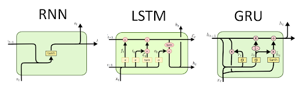

# PytorchLighningMnist
This is a simple example using pytorch lightning for Mnist digit classification. 
We explora many approaches to show how we can setup an artificial neural network to perform a given task.


## Architectures 
* Convnet
> Convolutional Neural Network (CNN)

>> This architecture is the best when it comes to images

* Recurents nets [(image source)](https://www.google.com/search?q=gru+unit&tbm=isch&ved=2ahUKEwjWsea1_MDtAhUT_IUKHUHhDcUQ2-cCegQIABAA&oq=gru+unit&gs_lcp=CgNpbWcQAzIECAAQEzIECAAQEzIECAAQEzIECAAQEzIICAAQBxAeEBMyCAgAEAcQHhATMggIABAHEB4QEzIICAAQBxAeEBMyCAgAEAcQHhATMggIABAFEB4QEzoECAAQQzoCCABQ_5QEWNScBGDyowRoAHAAeACAAcYDiAHRB5IBBzItMi4wLjGYAQCgAQGqAQtnd3Mtd2l6LWltZ8ABAQ&sclient=img&ei=pszQX9bGJpP4lwTBwreoDA&bih=806&biw=1536#imgrc=Gph1AoqM828XeM&imgdii=AIwsjHONVVYL2M)


> Recurrent architectures are used for testing as they show another approach to the problem of digit classification.

> Recurrent Neural Network (RNN)

> Long Short-Term Memory (LSTM)

> Gated Recurrent Unit (GRU)

# Usage 

```
$ python LitMnist.py --gpus 1 --arch gru --num_epochs 5 --test_batch_size 64 --train_batch_size 128   
   
```


Leave a star if you liked all the stuffs here :relieved: .